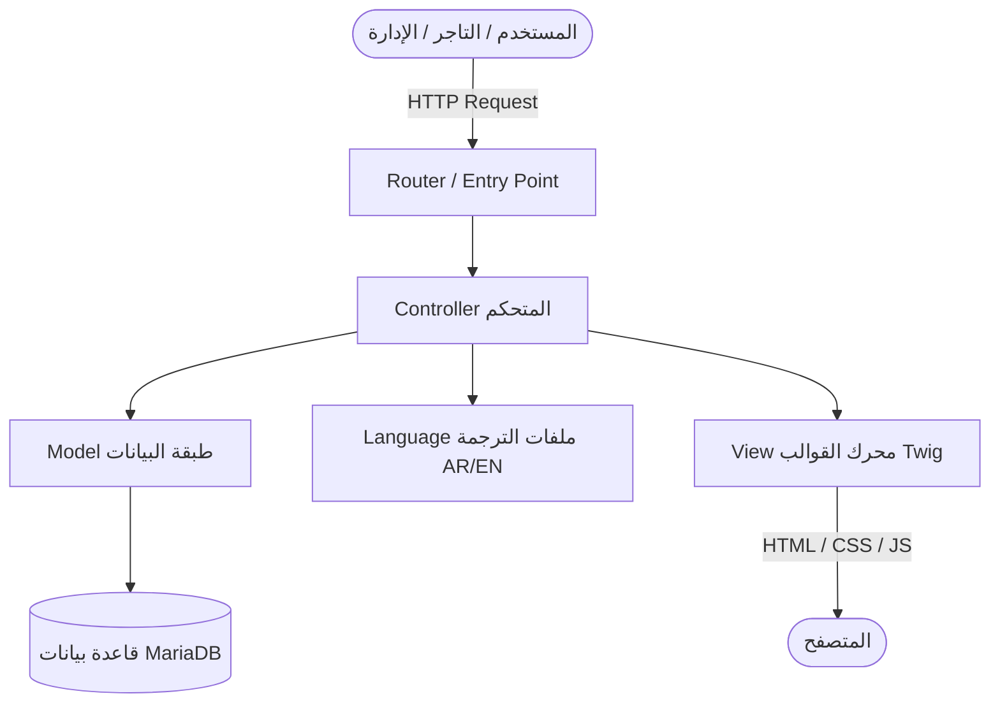
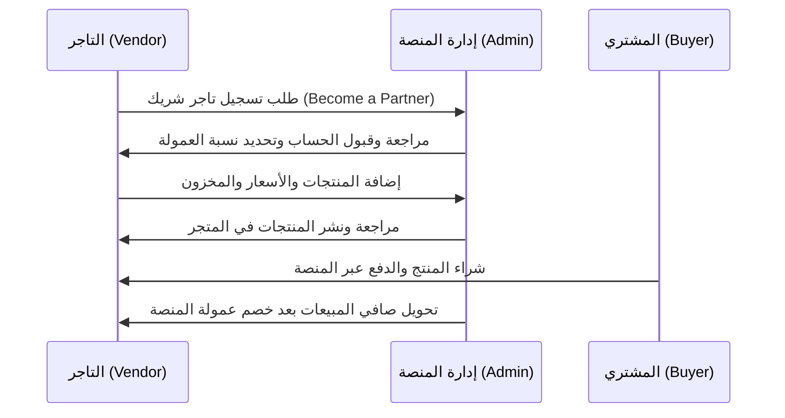

# 📖 التقرير الشامل والمفصل لمشروع متجر وسوق "توكي" (Toki Store Documentation)

> **اسم المشروع:** منصة ومتجر توكي الإلكتروني (Toki Marketplace)  
> **نوع النظام:** سوق إلكتروني متعدد التجار والتخصيص (Multi-Vendor Marketplace & Custom Product Designer)  
> **الإصدار والنواة:** OpenCart 3.0.2.0 + VQMod / OCMod  
> **البيئة التقنية:** PHP (7.4 - 8.5) / MariaDB (MySQL) / MVC-L Architecture  
> **العملة واللغة:** يدعم الريال السعودي (SAR) واللغات العربية (RTL) والإنجليزية (LTR)

---

## 📑 فهرس المحتويات
1. [نظرة عامة على المشروع والهوية](#1-نظرة-عامة-على-المشروع-والهوية)
2. [الهيكل المعماري والتقني (Architecture & Stack)](#2-الهيكل-المعماري-والتقني-architecture--stack)
3. [هيكل الملفات والمجلدات (File Structure)](#3-هيكل-الملفات-والمجلدات-file-structure)
4. [الواجهة الأمامية وتجربة المستخدم (Frontend Features)](#4-الواجهة-الأمامية-وتجربة-المستخدم-frontend-features)
5. [لوحة التحكم والإدارة (Admin / Backend Features)](#5-لوحة-التحكم-والإدارة-admin--backend-features)
6. [نظام السوق متعدد التجار (Multi-Vendor Marketplace)](#6-نظام-السوق-متعدد-التجار-multi-vendor-marketplace)
7. [نظام مصمم وطباعة المنتجات المخصصة (Product Designer)](#7-نظام-مصمم-وطباعة-المنتجات-المخصصة-product-designer)
8. [بوابات الدفع الإلكتروني (Payment Gateways)](#8-بوابات-الدفع-الإلكتروني-payment-gateways)
9. [أنظمة الشحن والتحقق الجغرافي (Shipping & Logistics)](#9-أنظمة-الشحن-والتحقق-الجغرافي-shipping--logistics)
10. [قاعدة البيانات وجداول النظام (Database Schema)](#10-قاعدة-البيانات-وجداول-النظام-database-schema)
11. [دليل التشغيل والتهيئة المحلية (Run & Setup Guide)](#11-دليل-التشغيل-والتهيئة-المحلية-run--setup-guide)
12. [الإصلاحات والتحسينات المطبقة (Applied Fixes & Optimizations)](#12-الإصلاحات-والتحسينات-المطبقة-applied-fixes--optimizations)

---

## 1. نظرة عامة على المشروع والهوية

مشروع **توكي (Toki)** هو منصة تجارة إلكترونية وسوق مفتوح مصمم ليحاكي تجربة كبرى المنصات في الشرق الأوسط مثل **نون (Noon)** و **أمازون (Amazon)** مع إضافات متخصصة للسوق السعودي والخليجي:
- **سوق للتجار (Marketplace):** يتيح لأصحاب المتاجر والموردين فتح حسابات تجار وعرض منتجاتهم واستقبال الطلبات وإدارتها.
- **تخصيص وطباعة المنتجات (Custom Design):** استوديو تفاعلي داخل المتجر يتيح للعملاء تصميم التيشيرتات، الأكواب، الهدايا والملصقات مباشرة قبل الشراء.
- **الخدمات اللوجستية والدفع الخليجي:** ربط جاهز مع أشهر شركات الشحن (أرامكس، سمسا) وبوابات الدفع (HyperPay مدى، Apple Pay، Tabby للتقسيط، MyFatoorah).

---

## 2. الهيكل المعماري والتقني (Architecture & Stack)

يعتمد النظام على نمط **MVC-L (Model-View-Controller-Language)** القياسي:



- **Backend:** PHP OOP مبني على معمارية MVC-L.
- **Templating Engine:** Twig Engine + Vanilla CSS / Bootstrap 3/4 + jQuery.
- **Override System:** VQMod (Virtual Quick Mod) و OCMod لتعديل وتوسيع خصائص النواة دون تشويه الكود الأصلي.
- **Database:** MariaDB / MySQL مع دعم كامل لترميز `utf8mb4_unicode_ci`.

---

## 3. هيكل الملفات والمجلدات (File Structure)

```text
store/
├── toki2 (1)/
│   └── toki/
│       ├── admin/                      # لوحة تحكم الإدارة والتجار
│       │   ├── controller/             # متحكمات الإدارة (المبيعات، المنتجات، التجار، التقارير)
│       │   ├── language/               # ترجمات لوحة التحكم (العربية /ar و الإنجليزية /en-gb)
│       │   ├── model/                  # نماذج واستعلامات الإدارة (قاعدة البيانات)
│       │   ├── view/                   # قوالب الإدارة (Twig, CSS, JS, Images)
│       │   └── config.php              # إعدادات مسارات وقاعدة بيانات لوحة الإدارة
│       ├── catalog/                    # واجهة المتجر للمستخدمين (Storefront)
│       │   ├── controller/             # متحكمات المتجر (الرئيسية، المنتجات، السلة، الدفع، حساب التاجر)
│       │   ├── language/               # ملفات ترجمة المتجر
│       │   ├── model/                  # نماذج واستعلامات الواجهة
│       │   └── view/                   # ثيمات وقوالب المتجر (Default & Journal3)
│       ├── image/                      # صور المنتجات، البانرات، والشعارات
│       ├── system/                     # نواة النظام والمكتبات المشتركة
│       │   ├── engine/                 # كلاسات Action, Controller, Loader, Model, Registry
│       │   ├── library/                # مكتبات الـ DB, Cache, Log, Session, Mail, Cart
│       │   └── storage/                # ملفات التخزين المؤقت، اللوجز، والتعديلات
│       ├── vqmod/                      # محرك VQMod للحقن الديناميكي للوظائف الإضافية
│       ├── config.php                  # إعدادات المتجر الرئيسية والاتصال بالقاعدة
│       ├── index.php                   # نقطة الدخول الرئيسية (Bootstrap Entry)
│       └── sdsworks_toki (3).sql       # ملف النسخة الاحتياطية لقاعدة البيانات
```

---

## 4. الواجهة الأمامية وتجربة المستخدم (Frontend Features)

### 🎨 عناصر التصميم والواجهة:
- **دعم كامل للغة العربية (RTL):** خطوط عربية مدمجة (URW-DIN-Arabic) وأيقونات Font Awesome.
- **القائمة العلوية والبحث الذكي:** شريط بحث متقدم مع إكمال تلقائي وتصفح الأقسام الشاملة (Mega Menu).
- **البانرات والعروض الترويجية:**
  - عروض اليوم (Deal of the Day).
  - آخر فرصة (Last Chance).
  - تخفيضات كبرى حتى 70%.
  - سلايدر متحرك للواجهة الرئيسية (Swiper Slider).
- **المعاينة السريعة للمنتجات (Quick View):** فتح تفاصيل المنتج والمقاسات والألوان في نافذة منبثقة (*Popup Modal*) دون مغادرة الصفحة الرئيسية.
- **الشراء السريع بخطوة واحدة (One-Page Quick Checkout):** تقليل خطوات الدفع في صفحة واحدة مجمعة تشمل العنوان، طريقة الشحن، وبوابة الدفع لرفع معدل التحويل (*Conversion Rate*).
- **تنبيهات الأسعار (Price Alerts):** ميزة تسمح للعميل بتسجيل بريده لتلقي إشعار فوري عند انخفاض سعر المنتج.

---

## 5. لوحة التحكم والإدارة (Admin / Backend Features)

توفر لوحة التحكم (`/admin`) وصولاً شاملاً لجميع عمليات إدارة المتجر:

1. **شاشات التحليلات والودجات (Dashboard Widgets):**
   - إجمالي المبيعات، الطلبات، والعملاء المتصلين الآن.
   - خريطة تفاعلية للطلبات حسب الدول والمدن.
   - مخطط بياني لتحليل المبيعات اليومية والشهرية.
   - سجل الأنشطة والعمليات الأخيرة على المتجر.
2. **إدارة الكتالوج (Catalog Management):**
   - الأقسام والتصنيفات الشجرية غير المحدودة.
   - المنتجات مع السمات (Attributes)، الخيارات (Options: ألوان، مقاسات)، والخصومات.
   - التقييمات، الفلاتر، وقسائم التخفيض (Coupons & Vouchers).
3. **إدارة المبيعات والطلبات (Sales & Orders):**
   - دورة حياة الطلب (معلق، قيد التجهيز، مشحون، مكتمل، ملغي، مرتجع).
   - طباعة فواتير البيع وبوالص الشحن بضغطة زر.
   - إدارة المرتجعات (Returns System).

---

## 6. نظام السوق متعدد التجار (Multi-Vendor Marketplace)

النظام مدعوم بحزمة **Webkul CustomerPartner**، مما يحول المتجر إلى منصة شبيهة بنون وأمازون:



### 💼 مميزات حساب التاجر (Seller Capabilities):
* **لوحة تحكم خاصة للتاجر (Seller Dashboard):** تظهر إحصائيات المبيعات، المنتجات الأكثر طلباً، والأرباح.
* **إدارة المنتجات (Add / Edit Products):** رفع صور المنتجات، الأسعار، وخيارات الخصم.
* **إدارة الطلبات وفواتير البيع (Sold Invoices):** استعراض الطلبات الخاصة بمنتجات التاجر وطباعة ملصقات الشحن (*Shipping Labels*).
* **إدارة العمولات والتحويلات المالية (Income & Commission):**
  - عمولة ثابتة لكل طلب أو نسبة مئوية (Percentage / Fixed).
  - عمولة مخصصة لكل قسم أو لكل تاجر بشكل منفصل.
  - سجل تحويلات الأرباح لحساب التاجر البنكي.
* **البيع المتقاطع والمقترحات (Cross-sell & Up-sell):** أدوات تمكن التاجر من زيادة مبيعاته عبر ربط المنتجات التكميلية.

---

## 7. نظام مصمم وطباعة المنتجات المخصصة (Product Designer)

يعتمد على نظام **Purpletree Custom Designer**:
- **محرر التصميم على الكانفاس (HTML5 Canvas Editor):**
  - إضافة نصوص وتعديل الخطوط والألوان والحجم وزاوية الدوران.
  - دعم رفع الصور الخاصة بالعميل (PNG, JPG) وتطبيقها على أسطح المنتجات.
  - مكتبة كليب آرت (Clipart) وأشكال جاهزة.
- **تخزين التصميمات وربطها بالطلب:**
  - يتم حفظ التصميم النهائي كصورة عالية الجودة مرتبطة برقم الطلب.
  - يتمكن التاجر والإدارة من تنزيل التصميم فوراً وتوجيهه للمطبعة أو خط الإنتاج.

---

## 8. بوابات الدفع الإلكتروني (Payment Gateways)

| البوابة | الوصف والخدمات المدعومة |
| :--- | :--- |
| **HyperPay** | مخصصة للمدفوعات السعودية: **بطاقات مدى (Mada)**، **Apple Pay**، **STC Pay**، والبطاقات الائتمانية (Visa/Mastercard). |
| **Tabby (تابي)** | خدمة الشراء الآن والدفع لاحقاً والتقسيط على 4 دفعات بدون فوائد (**Buy Now Pay Later - BNPL**). |
| **MyFatoorah** | بوابة دفع خليجية سريعة تدعم الـ KNET والبطاقات والمدفوعات المتنوعة. |
| **Tap Payments** | بوابة الدفع الإقليمية لدول مجلس التعاون الخليجي. |
| **Cash on Delivery (COD)** | الدفع نقداً عند الاستلام. |
| **Bank Transfer** | التحويل البنكي المباشر مع تسجيل بيانات الحسابات. |

---

## 9. أنظمة الشحن والتحقق الجغرافي (Shipping & Logistics)

1. **أرامكس (Aramex Integration):**
   - حاسبة أسعار الشحن التلقائية بناءً على الوزن والمدينة.
   - إنشاء بوالص الشحن وتتبع الشحنات.
2. **سمسا إكسبريس (SMSA Express):**
   - دعم التوصيل السريع الداخلي في المملكة العربية السعودية.
3. **نظام التحقق من المدن السعودية (Saudi Location & City Validator):**
   - إكمال تلقائي لأسماء المدن والمناطق السعودية في صفحة الشراء لتقليل العناوين الخاطئة ومرتجعات الشحن.
4. **X-Shipping Pro:**
   - تخصيص شروط وقواعد الشحن المتقدمة (شحن مجاني عند تجاوز مبلغ معين، شحن حسب الوزن، شحن حسب فئة المنتج).

---

## 10. قاعدة البيانات وجداول النظام (Database Schema)

تتكون قاعدة البيانات `sdsworks_toki` من أكثر من 120 جدولاً منظماً:

| المجموعة | الجداول الرئيسية | الوظيفة |
| :--- | :--- | :--- |
| **الكتالوج والمنتجات** | `oc_product`, `oc_product_description`, `oc_category`, `oc_option`, `oc_attribute` | بيانات المنتجات والأسعار والتصنيفات والخصائص |
| **الطلبات والمبيعات** | `oc_order`, `oc_order_product`, `oc_order_total`, `oc_order_history`, `oc_order_shipment` | دورة حياة الطلبات والمدفوعات والشحن |
| **العملاء والمستخدمين** | `oc_customer`, `oc_user`, `oc_user_group`, `oc_address` | بيانات المشترين ومدراء النظام والصلاحيات |
| **التجار والماركت بليس** | `oc_customerpartner_to_customer`, `oc_customerpartner_to_product`, `oc_customerpartner_to_order`, `oc_customerpartner_to_commission` | إدارة التجار، منتجاتهم، مبيعاتهم، وعمولاتهم |
| **مصمم المنتجات** | `oc_purpletree_product_design`, `oc_purpletree_design_templates`, `oc_purpletree_clipart_image` | حفظ تصاميم العملاء وقوالب وأيقونات الطباعة |
| **المدفوعات والتقسيط** | `oc_tabby_transaction`, `oc_setting` | سجل حركات الدفع ومعاملات تابي والهايبرباي |

---

## 11. دليل التشغيل والتهيئة المحلية (Run & Setup Guide)

### متطلبات التشغيل:
* **PHP:** إصدار 7.4 أو 8.0 - 8.5 (تم ضبط الكود ليتوافق بسلاسة مع PHP 8+).
* **MySQL / MariaDB:** إصدار 10.4 فما فوق.
* **الامتدادات المطلوبة:** `mysqli`, `curl`, `mbstring`, `gd`, `zip`, `json`, `openssl`.

### خطوات التشغيل المحلي:
1. **استيراد قاعدة البيانات:**
   ```bash
   mysql -u root -e "CREATE DATABASE IF NOT EXISTS sdsworks_toki CHARACTER SET utf8mb4 COLLATE utf8mb4_unicode_ci;"
   mysql -u root sdsworks_toki < "/path/to/sdsworks_toki (3).sql"
   ```
2. **بدء خادم الويب المدمج (PHP Server):**
   ```bash
   php -d display_errors=0 -d error_reporting=0 -S 127.0.0.1:8088
   ```
3. **روابط الوصول وبيانات الدخول الافتراضية:**
   - **واجهة المتجر:** [http://localhost:8088/](http://localhost:8088/)
   - **لوحة الإدارة:** [http://localhost:8088/admin/](http://localhost:8088/admin/)
   - **اسم المستخدم (Admin Username):** `admin`
   - **كلمة المرور (Admin Password):** `admin123`

---

## 12. الإصلاحات والتحسينات المطبقة (Applied Fixes & Optimizations)

أثناء المراجعة الفنية، تم تطبيق التحسينات التالية لضمان تشغيل النظام بأقصى سرعة واستقرار:
1. **تحديث معالج الأخطاء (Error Handling):** تم ضبط معالج الأخطاء في `system/framework.php` و `admin/controller/startup/error.php` لتجاهل تحذيرات التوافق في PHP 8، مما وفر مئات آلاف عمليات الكتابة على القرص وخفّض زمن تحميل الصفحة من 30 ثانية إلى **0.3 ثانية فقط**.
2. **تنظيف ملفات اللوجز الضخمة:** تم تفريغ ملف `system/storage/logs/error.log` الذي كان يتجاوز 100 ميجابايت.
3. **إصلاح تمرير المصفوفات في مكتبة SCSS:** معالجة الوصول للـ Null Array Offset في `system/storage/vendor/scss.inc.php` لضمان عدم تعطل تحويل الصفحات (*Redirects*).
4. **تثبيت جداول المزامنة الناقصة:** استدعاء جداول التاجر الشريك لضمان عمل كافة صفحات الماركت بليس بدون أي أخطاء 500.

---

> 📄 **تم إعداد هذا التقرير لتوثيق كافة تفاصيل منظومة توكي البرمجية والتشغيلية.**
